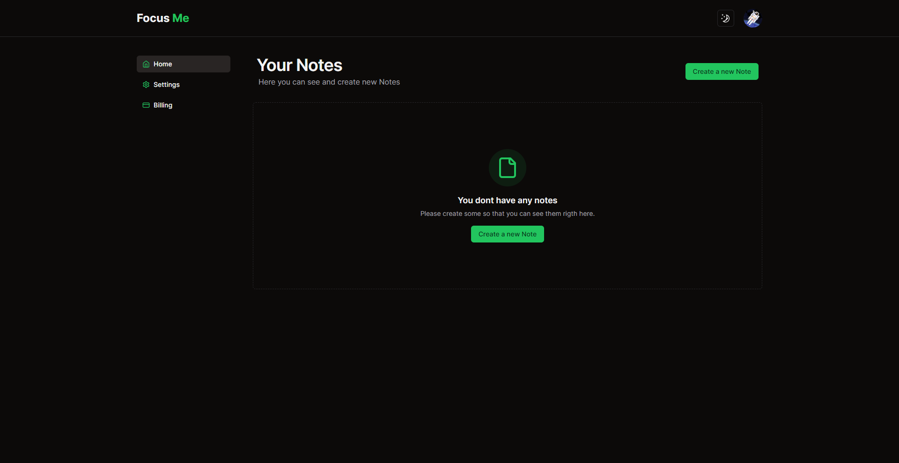

# Proyecto SaaS con Next.js, Supabase, Kinde, Prisma, Stripe, Tailwind UI y Shadcn/ui

Este es un proyecto SaaS diseñado para mi portafolio y desplegado en Vercel. La aplicación te permite crear notas una vez estés suscrito.

Este es un proyecto [Next.js](https://nextjs.org/) iniciado con [`create-next-app`](https://github.com/vercel/next.js/tree/canary/packages/create-next-app).



[ - > FOCUS ME DEPLOY DEMO](https://focus-me.vercel.app/)

Empezando:

## Primero configura las variables de entorno .env

Primero, ejecuta el servidor de desarrollo:

```bash
npm run dev
# o
yarn dev
# o
pnpm dev
# o
bun dev
```

Abre http://localhost:3000 en tu navegador para ver el resultado.

Puedes empezar a editar la página modificando app/page.tsx. La página se actualizará automáticamente mientras edites el archivo.

Despliegue en Vercel
La forma más fácil de desplegar tu aplicación Next.js es usando la Plataforma Vercel de los creadores de Next.js.